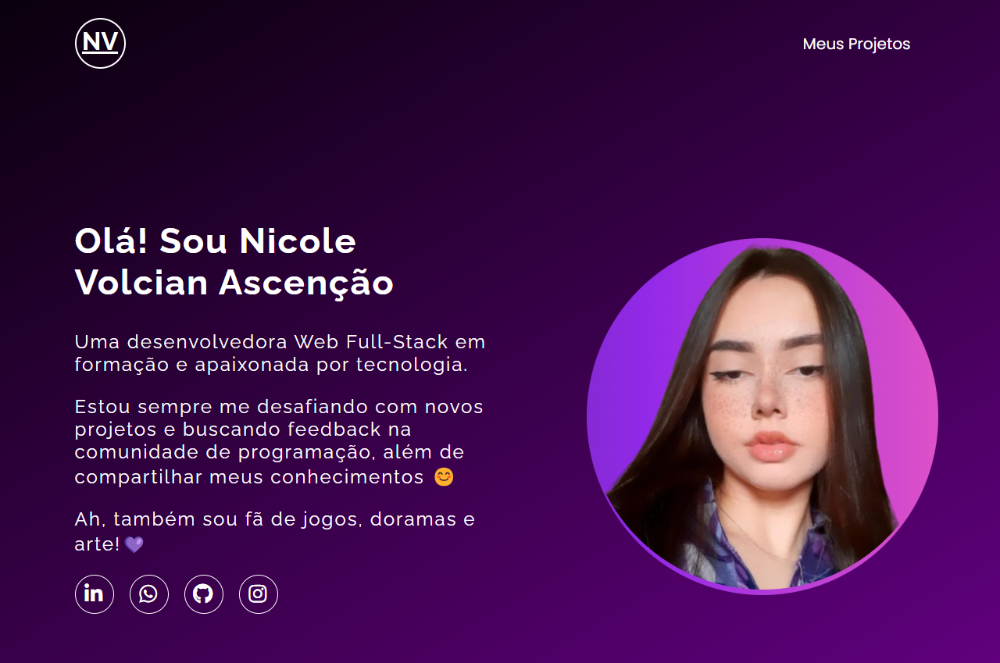

## 📖 Sobre

Projeto de portfólio realizado em 3 aulas de um evento utilizando HTML, CSS e JS.

  
    

 

## 💻 Tecnologias

Esse projeto foi desenvolvido com as seguintes tecnologias:

- HTML
- CSS
- Javascript

 

## 🚀 Visualizar o Projeto

O projeto pode ser visualizado [aqui](https://nicolevlc.github.io/projeto-portfolio/).

 

## 📝 Licença
Esse projeto está sob a licença MIT. Veja o arquivo **LICENSE** para mais detalhes.